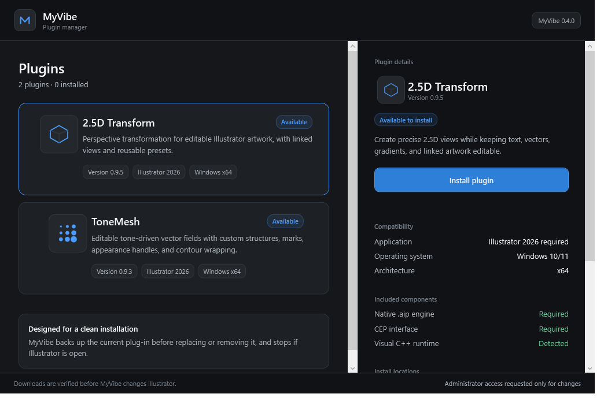

  

<h1 align="center">MyVibe</h1>

A focused, safe manager for installing and maintaining creative plug-ins.

  
  
  
  

## Install creative tools without manual folder work

MyVibe shows compatible plug-ins, their installed and available versions, and the applications they support. Installation and removal create a backup first and stop safely when Adobe Illustrator is open.

MyVibe currently manages two plug-ins independently:

- **2.5D Transform** — non-destructive X/Y/Z and perspective workflows for editable Illustrator artwork.
- **ToneMesh** — editable tone-driven vector fields with custom marks, structures, appearance handles, and contour wrapping.

## Download

Open [Releases](https://github.com/badrulmokhtar/myvibe/releases) and download the latest **MyVibe Windows x64** ZIP. Extract it to a writable user folder, run `MyVibe.exe`, and approve administrator access only when installing, updating, or removing a plug-in.

MyVibe 0.3.1 can update all installed plug-ins from one action. It downloads and verifies every package before requesting one administrator approval.

> Upgrading from MyVibe 0.2? That version detects 0.3.1 but cannot replace its own unsigned executable. Download and extract 0.3.1 once. Future verified manager updates can install and restart in-app from MyVibe 0.3+.

> MyVibe is currently a beta. Windows may display an Unknown publisher warning until the production signing certificate is enabled. Beta limitations are always stated in the release notes.

MyVibe 0.4 beta adds a universal macOS manager and a cross-platform catalog. Beta packages can be published without Windows Authenticode or Apple Developer ID certificates, but MyVibe shows an explicit warning before installation and continues to require the signed catalog, official release URL, and exact SHA-256 checksum. See [Unsigned beta installation](docs/UNSIGNED-BETA.md).

## User guide

Follow the [MyVibe user guide](docs/USER-GUIDE.md) for installation, updates, removal, recovery, and the complete 2.5D Transform workflow.

Prefer a printable edition? [Download the PDF user guide](docs/MyVibe-and-2.5D-Transform-User-Guide.pdf).

## Compatibility

| Component | Current support |
| --- | --- |
| Operating system | Windows 10/11 x64; macOS 13+ universal in the 0.4 beta candidate |
| Adobe application | Illustrator 2026, version 30.x |
| MyVibe | 0.3.1 Windows beta; 0.4.0 macOS beta candidate |
| 2.5D Transform | 0.9.5 beta |
| ToneMesh | 0.9.3 beta |

MyVibe verifies [`catalog.json`](catalog.json) against [`catalog.json.sig`](catalog.json.sig), verifies package checksums, and retains the last verified catalog for offline use.

The existing signed v1 catalog remains the compatibility source for MyVibe
0.3.x on Windows. [`catalog-v2.schema.json`](catalog-v2.schema.json) defines the
cross-platform contract used by MyVibe 0.4+, with separate Windows and macOS
artifacts and platform-appropriate Authenticode or Apple Developer ID policy.
The live v2 catalog will be published only after the Mac manager and plug-in
packages have final release URLs and hashes. Unsigned beta artifacts use
`signature.required: false`; stable artifacts always require platform-trusted
signatures and the expected publisher identity.

## Trust and privacy

- Release assets include SHA-256 checksums.
- Catalog metadata is signed independently from GitHub hosting.
- Stable Windows assets must carry a trusted Authenticode signature; stable macOS assets must carry the expected Apple Developer ID signature.
- CEP panels are packaged with Adobe's signing tool.
- No account, telemetry, advertising, or background service is required.
- Source code, SDK paths, signing material, and development history are not distributed from this repository.

Read [Security](SECURITY.md), [Support](SUPPORT.md), and the [Changelog](CHANGELOG.md) before reporting a problem.

## Version history

Every published version remains available through [GitHub Releases](https://github.com/badrulmokhtar/myvibe/releases). `catalog.json` points MyVibe to the current compatible versions; releases and tags preserve the history.

## License

MyVibe and its distributed plug-ins are provided under the [MyVibe Binary License](LICENSE.txt).
